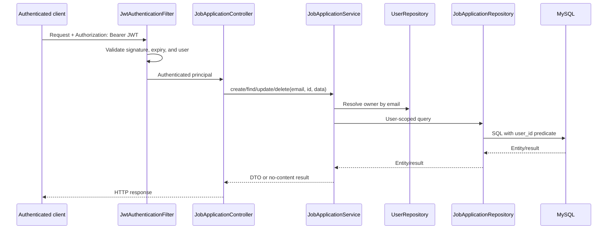

# Job Application Sequence

```mermaid
sequenceDiagram
    participant C as Authenticated client
    participant F as JwtAuthenticationFilter
    participant A as JobApplicationController
    participant S as JobApplicationService
    participant U as UserRepository
    participant R as JobApplicationRepository
    participant DB as MySQL

    C->>F: Request + Authorization: Bearer JWT
    F->>F: Validate signature, expiry, and user
    F->>A: Authenticated principal
    A->>S: create/find/update/delete(email, id, data)
    S->>U: Resolve owner by email
    S->>R: User-scoped query
    R->>DB: SQL with user_id predicate
    DB-->>R: Entity/result
    R-->>S: Entity/result
    S-->>A: DTO or no-content result
    A-->>C: HTTP response
```

The `user_id` predicate is part of the service/repository access path and prevents a user from addressing another user's application by ID.
